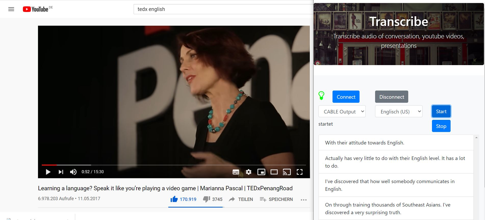

# transcribe
Transcribe audio of conversation, youtube videos, presentations

Using `AWS Transcribe Service to transcribe system sound like conversation on Skype or TedX Talks on Youtube.




## Get started
```
mvn package
```

## aws user
You will need aws user which has assigned following policies for using the aws services 

* AmazonTranscribeFullAccess

save credentials in %USERPROFILE%/.aws/credentials

```
[default]
aws_access_key_id = <accesskey>
aws_secret_access_key = <secretacceskey>
output = json
region = eu-central-1
```

## Start
```
java -jar target/transcribe-0.0.1-SNAPSHOT.jar
```

Now open  `http://localhost` and select input device and langage


## Record system sound

In order to record system sound (youtube, skype, ...) you have to activate `Stereo Mix` in sound perferences.


If your windows does not support `Stereo Mix` you can use as alternative `VB-CABLE Virtual Audio Device`.


## Future Use

I want use the application for:
* automatic translation of transcribed text
* talk to language bot and learn a language

Did you have any ideas, than write me projekte(at)frittenburger(dot)de